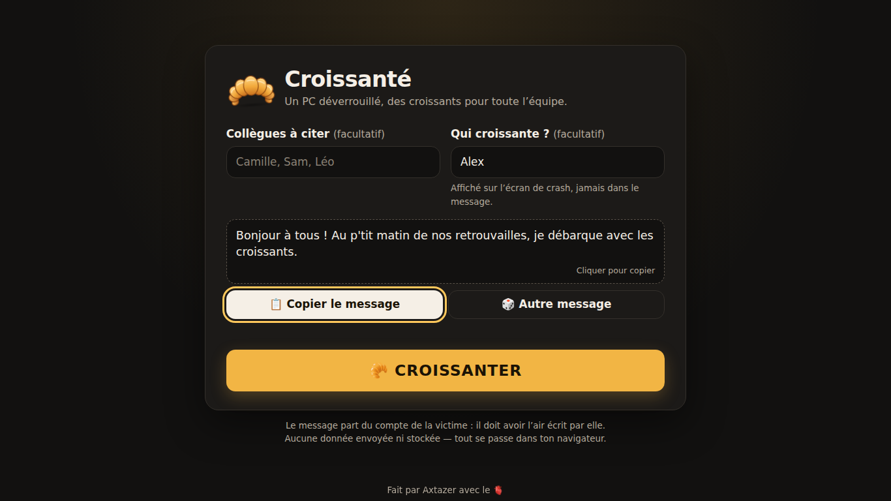
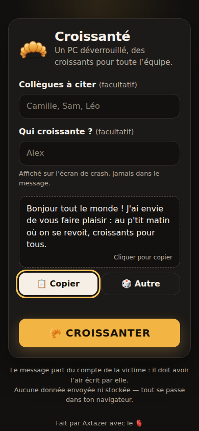
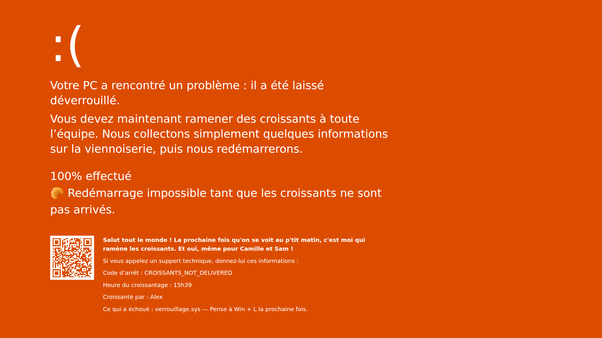
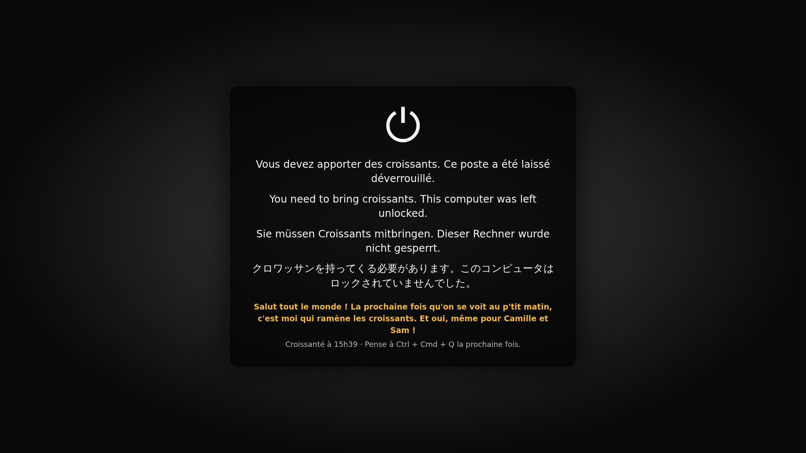
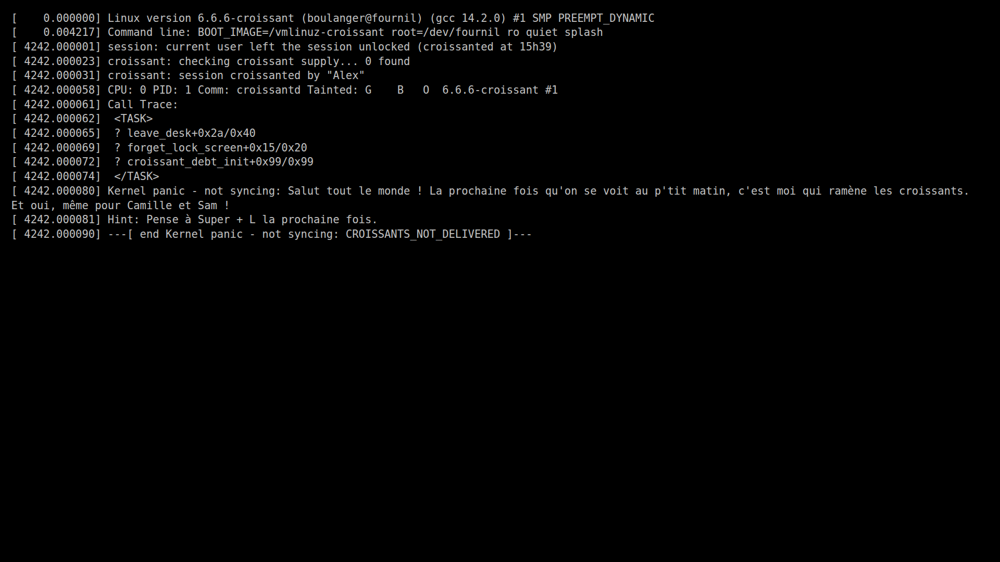

# Croissanté 🥐

[](https://github.com/Axtazer/french-breakfast/actions/workflows/ci.yml)
[](https://github.com/Axtazer/french-breakfast/actions/workflows/docker-publish.yml)
[](LICENSE)

Petite application web pour **« croissanter »** un collègue qui a laissé son PC déverrouillé en open space.

La tradition : quand quelqu'un quitte son poste sans le verrouiller, un collègue envoie un message depuis ce poste
pour annoncer que son propriétaire ramènera les croissants. Croissanté rend l'opération rapide, propre et amusante :

1. depuis le poste déverrouillé, ouvrir l'app : un message crédible est déjà prêt, comme si la victime l'avait écrit
   (« Salut tout le monde ! La prochaine fois qu'on se voit au p'tit matin, c'est moi qui ramène les croissants. ») ;
   🎲 pour en changer, mention facultative de collègues (« Et oui, même pour Camille, Sam et Léo ! ») ;
2. **un clic sur le message le copie** (ou bouton 📋) : le coller dans Teams, Slack… il part **avec le compte de la victime** ;
3. **🥐 CROISSANTER** : un **faux écran de crash** adapté à l'OS du poste s'affiche aussitôt **en plein écran**
   (écran de crash Windows version orange, kernel panic macOS ou Linux).

> L'application **n'envoie rien** : elle génère uniquement un message prêt à copier/coller.
> Aucun compte, aucun secret, aucune intégration Teams/mail.

## Screenshot

| Accueil (desktop) | Accueil (mobile) |
| --- | --- |
|  |  |

Écrans de crash (choisis automatiquement selon l'OS) :

| Windows | macOS | Linux |
| --- | --- | --- |
|  |  |  |

## Architecture

- **Serveur** : Node.js 22, module `node:http` natif — **zéro dépendance runtime**.
  Il sert les fichiers statiques (chargés en mémoire au démarrage, donc aucun path traversal possible),
  expose `/health` et `/config.json`, et ajoute les headers de sécurité (CSP stricte, etc.).
- **Frontend** : HTML/CSS/JavaScript vanilla (modules ES), sans framework ni build.
- **Pas de base de données**, pas de stockage serveur.

Pourquoi ce choix ? Un framework (React, Express…) n'apporterait rien ici. Un serveur Node minimal plutôt qu'un
nginx statique permet de garder un vrai endpoint `/health` JSON, une configuration par variables d'environnement
et des tests simples avec `node --test`, le tout avec un seul langage et sans aucun `npm install` en production.

```
.
├── .github/
│   ├── CODEOWNERS, pull_request_template.md, ISSUE_TEMPLATE/
│   ├── dependabot.yml          # mises à jour (actions, image de base, devDeps)
│   ├── release.yml             # catégories des notes de release
│   ├── rulesets/               # règles de merge importables (main, tags)
│   └── workflows/
│       ├── ci.yml              # lint + tests + build Docker + smoke test
│       ├── docker-publish.yml  # publication sur GHCR
│       └── release.yml         # GitHub Release à chaque tag vX.Y.Z
├── deploy/kubernetes.yaml      # exemple Deployment + Service
├── docs/                       # captures d'écran, configuration du dépôt GitHub
├── public/                     # frontend (servi tel quel)
│   ├── index.html              # formulaire
│   ├── croissante.html         # vue alternative « CE PC A ÉTÉ CROISSANTÉ »
│   ├── crash.html              # faux écran de crash selon l'OS
│   ├── css/style.css, css/crash.css
│   ├── img/croissant.svg       # logo
│   ├── img/qr-boulangerie.svg  # QR code de l'écran de crash (généré)
│   └── js/
│       ├── app.js              # logique de la page d'accueil
│       ├── fullscreen.js       # logique de la vue alternative
│       ├── crash.js            # page /crash (accès direct)
│       ├── crash-view.js       # rendu des écrans de crash (accueil et /crash)
│       ├── crash-content.js    # textes des écrans de crash — testés
│       ├── os.js               # détection de l'OS (locale) — testée
│       ├── message.js          # logique pure (templates, nettoyage) — testée
│       ├── config.js           # chargement de /config.json
│       └── defaults.js         # configuration par défaut (partagée avec le serveur)
├── scripts/generate-qr.mjs     # régénère le QR code (npm run qr)
├── src/
│   ├── server.js               # serveur HTTP
│   ├── config.js               # chargement de la config (défauts < CONFIG_FILE < env)
│   └── healthcheck.js          # utilisé par le HEALTHCHECK Docker
├── test/                       # tests node:test
├── config.example.json
├── Dockerfile
└── package.json
```

## Utilisation

| URL | Effet |
| --- | --- |
| `/` | Formulaire |
| `/?with=Camille,Sam` | Formulaire avec des collègues à mentionner pré-remplis |
| `/?by=Alex` | Formulaire avec le croissanteur pré-rempli |
| `/croissante?by=Alex` | Vue alternative « CE PC A ÉTÉ CROISSANTÉ » (non liée depuis l'accueil) |
| `/crash?by=Alex` | Faux écran de crash adapté à l'OS détecté (`with` et `m` = mentions et n° de message) |
| `/crash?os=mac` | Idem en forçant l'OS (`windows`, `mac`, `linux`, `chromeos`, `ios`, `android`) |
| `/health` | `{"status":"ok"}` (HTTP 200) |
| `/config.json` | Configuration publique utilisée par le frontend |

Le nom de la victime n'est jamais demandé : le message est envoyé depuis son poste, donc avec son propre compte,
et doit avoir l'air écrit par elle. Le croissanteur n'apparaît jamais dans le message (ça grillerait la blague),
seulement sur l'écran de crash.

Le message n'est pas modifiable : il est conçu pour être copié tel quel, sans risque d'erreur de copier-coller.

Astuce : mettre `/?by=VotrePrénom` en favori pour croissanter encore plus vite.

Les paramètres d'URL sont nettoyés (caractères de contrôle, longueur max) et toujours insérés via `textContent` :
ils ne sont jamais interprétés comme du HTML.

### Détection de l'OS

L'OS est détecté **dans le navigateur uniquement** (`navigator.userAgentData.platform`, sinon `navigator.userAgent`) ;
rien n'est envoyé ni enregistré. Il sert à :

- afficher le bon raccourci de verrouillage (`Win + L`, `Ctrl + Cmd + Q`, `Super + L`, `Recherche + L`,
  texte générique sinon) ;
- choisir l'écran de crash : Windows (et OS inconnu) → écran de crash orange façon Windows ; macOS / iOS → kernel panic multilingue ;
  Linux / ChromeOS / Android → kernel panic console.

La détection est approximative par nature (un iPad se présente comme un Mac, le user-agent peut être modifié) :
`?os=` permet de forcer le résultat. Sur Linux, le raccourci dépend de l'environnement de bureau (configurable).

L'écran de crash affiche le message du croissantage, l'**heure du croissantage**, le croissanteur, le code d'arrêt et
le raccourci de verrouillage. Sur l'écran Windows, le **QR code** est un vrai QR code qui ouvre
[les boulangeries à proximité sur Google Maps](https://www.google.com/maps/search/?api=1&query=boulangerie).
C'est une image statique (`public/img/qr-boulangerie.svg`) générée par `npm run qr` (`scripts/generate-qr.mjs`) :
aucune requête externe tant que personne ne le scanne.
Depuis l'accueil, **🥐 CROISSANTER** l'affiche dans la même page et appelle `requestFullscreen()` dans le même clic :
c'est ce geste utilisateur qui autorise le plein écran (aucun contournement des restrictions navigateur).
En accès direct à `/crash`, le navigateur exige un clic : un clic n'importe où passe alors en plein écran.
Le curseur se masque après quelques secondes ; le bouton « ← Accueil » reste accessible au survol (en bas à droite)
ou au clavier (Tab).

La copie utilise l'API Clipboard (`navigator.clipboard.writeText`). Celle-ci n'est disponible qu'en contexte sécurisé
(HTTPS ou `localhost`) ; en HTTP simple sur un intranet, un repli (`document.execCommand('copy')`) est utilisé, et
si tout échoue un message invite à copier manuellement.

## Lancement local

Prérequis : Node.js ≥ 22.

```bash
npm install      # dépendances de dev uniquement (ESLint, qrcode)
npm run dev      # http://localhost:8080, redémarre à chaque modification
```

Autres commandes :

```bash
npm start        # lancement simple
npm run lint     # ESLint
npm test         # tests (node --test)
npm run check    # lint + tests (avant chaque push)
npm run qr       # régénère le QR code de l'écran de crash
```

## Docker

```bash
docker build -t croissante .
docker run --rm -p 8080:8080 croissante
```

- Port : **8080** (modifiable via `PORT`).
- Utilisateur non-root (UID 1000), aucune dépendance installée, image de base `node:22-alpine` épinglée par digest.
- `HEALTHCHECK` intégré (appel de `/health`).
- Compatible rootfs en lecture seule (`docker run --read-only --cap-drop ALL …`).

## GitHub Container Registry

L'image est publiée automatiquement par `.github/workflows/docker-publish.yml`, pour `linux/amd64` et `linux/arm64` :

```bash
docker pull ghcr.io/OWNER/REPO:latest
docker run --rm -p 8080:8080 ghcr.io/OWNER/REPO:latest
```

Pour ce dépôt : `ghcr.io/axtazer/french-breakfast` (les noms d'image GHCR sont toujours en minuscules).

## Versioning

Le projet suit [Semantic Versioning](https://semver.org/lang/fr/). Pour publier une release :

```bash
git tag v1.0.0
git push origin v1.0.0
```

Le tag publie l'image Docker et crée une **GitHub Release** avec des notes générées à partir des PR mergées.
Les tags `v*` sont protégés (ni déplacés, ni supprimés) : une version publiée est immuable.

| Événement | Tags publiés |
| --- | --- |
| Tag Git `v1.2.3` | `1.2.3`, `1.2`, `1`, `latest`, `sha-xxxxxxx` |
| Tag Git `v0.4.1` | `0.4.1`, `0.4`, `latest`, `sha-xxxxxxx` (pas de `0`, instable par définition) |
| Tag Git `v1.3.0-rc.1` | `1.3.0-rc.1`, `sha-xxxxxxx` (pré-release : ni `1.3`, ni `1`, ni `latest`) |
| Push sur `main` | `main`, `sha-xxxxxxx` |
| Pull Request | rien n'est publié (build + tests uniquement, via `ci.yml`) |

**`latest` = dernière release taguée**, jamais un simple commit sur `main`. Pour suivre le développement,
utiliser le tag `main`. Pour la production, épingler une version (`1.2.3`, ou `1.2` pour recevoir les correctifs).

> Attention : pousser un tag plus ancien (ex. `v1.0.5` après `v1.1.0`) déplace aussi `latest` vers ce tag.

## Configuration

Aucune configuration n'est obligatoire et **aucun secret n'est nécessaire**. Toutes les valeurs sont publiques
(elles sont envoyées au navigateur via `/config.json`).

Priorité : valeurs par défaut < fichier JSON (`CONFIG_FILE`) < variables d'environnement.
Une valeur invalide est ignorée (avec un avertissement dans les logs).

| Variable d'env. | Clé JSON | Défaut | Description |
| --- | --- | --- | --- |
| `APP_NAME` | `appName` | `Croissanté` | Nom affiché |
| `APP_TAGLINE` | `tagline` | `Un PC déverrouillé, …` | Sous-titre |
| `ENABLE_BY_FIELD` | `enableByField` | `true` | Affiche le champ « Qui croissante ? » |
| `MESSAGE_TEMPLATES` | `messageTemplates` | 5 messages (« Salut tout le monde ! La prochaine fois qu'on se voit au p'tit matin… ») | Messages tirés au hasard. Env : séparés par `\|` ; JSON : tableau |
| `INCLUDE_TEMPLATE` | `includeTemplate` | `Et oui, même pour {names} !` | Phrase ajoutée si des collègues sont mentionnés (vide = désactivé) |
| `FULLSCREEN_SUBJECT` | `fullscreenSubject` | `Ce PC` | Gros texte de la vue plein écran |
| `FULLSCREEN_TITLE` | `fullscreenTitle` | `A ÉTÉ CROISSANTÉ` | Texte principal de la vue plein écran |
| `FULLSCREEN_BYLINE` | `fullscreenByline` | `par {by}` | Ligne « par … » (vide = masquée) |
| `FULLSCREEN_SUBTITLE` | `fullscreenSubtitle` | `Pense à {shortcut} la prochaine fois.` | Texte secondaire (`{shortcut}` = raccourci de l'OS) |
| `FULLSCREEN_SUBTITLE_FALLBACK` | `fullscreenSubtitleFallback` | `Pense à verrouiller ton poste la prochaine fois.` | Texte secondaire si l'OS est inconnu |
| `LOCK_SHORTCUTS` | `lockShortcuts` | `{"windows":"Win + L","mac":"Ctrl + Cmd + Q","linux":"Super + L","chromeos":"Recherche + L"}` | Raccourcis par OS (objet JSON, fusionné avec les défauts) |
| `ENABLE_CRASH_SCREEN` | `enableCrashScreen` | `true` | Active l'écran de crash (sinon `/crash` renvoie vers la vue croissant) |
| `CRASH_STOP_CODE` | `crashStopCode` | `CROISSANTS_NOT_DELIVERED` | Code d'arrêt affiché sur l'écran de crash |
| `PRESET_NAMES` | `presetNames` | *(vide)* | Collègues proposés en un clic pour la mention (`Camille,Sam` / tableau JSON) |
| `REMEMBER_RECENT_NAMES` | `rememberRecentNames` | `false` | Mémorise les derniers collègues mentionnés **dans le navigateur** (localStorage) |
| `MAX_NAME_LENGTH` | `maxNameLength` | `40` | Longueur max d'un nom |
| `CONFIG_FILE` | — | — | Chemin d'un fichier JSON (voir `config.example.json`) |
| `PORT` | — | `8080` | Port d'écoute |
| `HOST` | — | `0.0.0.0` | Adresse d'écoute |

Placeholders : `{names}` dans `includeTemplate`, `{by}` dans `fullscreenByline`, `{shortcut}` dans `fullscreenSubtitle`.
Les messages sont envoyés depuis le compte de la victime : écrivez-les à la première personne, sans mention du croissanteur.
Les textes par défaut restent volontairement génériques (« au p'tit matin quand on se voit ») : adaptez-les à votre contexte.
Ils sont traités comme du texte brut.

Exemple :

```bash
docker run --rm -p 8080:8080 \
  -e PRESET_NAMES="Camille,Sam,Léo" \
  -e MESSAGE_TEMPLATES="Salut l'équipe ! Les croissants sont pour moi demain matin.|Hello ! Demain, petit-déj offert par moi." \
  ghcr.io/OWNER/REPO:latest
```

Ou avec un fichier (pratique en ConfigMap Kubernetes) :

```bash
docker run --rm -p 8080:8080 -v "$PWD/config.example.json:/config/config.json:ro" \
  -e CONFIG_FILE=/config/config.json ghcr.io/OWNER/REPO:latest
```

## Kubernetes

`deploy/kubernetes.yaml` contient un exemple générique et minimal :

- un `Deployment` (1 réplique, non-root, rootfs en lecture seule, capabilities supprimées, ressources modestes) ;
- des `readinessProbe` et `livenessProbe` HTTP sur `/health` ;
- un `Service` `ClusterIP` exposant le port nommé `http` (80 → 8080).

Remplacer `ghcr.io/OWNER/REPO:latest` par l'image réelle. `imagePullPolicy: Always` est cohérent avec le tag mobile
`latest` ; si vous épinglez une version (recommandé), passez à `IfNotPresent`.

```bash
kubectl apply -f deploy/kubernetes.yaml
```

Aucun Ingress n'est fourni : à ajouter selon votre infrastructure.

### Reverse proxy

L'application n'a aucune dépendance au hostname et n'utilise que des chemins relatifs : elle fonctionne derrière
Cloudflare Tunnel, un ingress Kubernetes ou n'importe quel reverse proxy HTTPS. Elle fonctionne aussi sous un
sous-chemin (ex. `/croissant/`) si le proxy retire le préfixe et que l'URL d'accueil se termine par `/`.
Servir l'application en **HTTPS** est recommandé (l'API Clipboard moderne l'exige ; un repli existe sinon).

## Sécurité et vie privée

- **Aucun tracking**, aucune analytics, aucune publicité, aucun cookie.
- **Aucune ressource externe** (pas de Google Fonts, pas de CDN) : polices système, logo SVG embarqué.
- **Aucun stockage par défaut** : le nom saisi ne sert qu'à générer le message localement, dans le navigateur.
  Le serveur ne reçoit les noms que s'ils sont dans l'URL, et ne les journalise pas.
  La mémorisation des derniers noms (`REMEMBER_RECENT_NAMES`) est désactivée par défaut et reste locale au navigateur.
- **Aucun envoi automatique** de message (ni Teams, ni mail).
- **Protection XSS** : aucune donnée utilisateur n'est insérée via `innerHTML` (règle ESLint qui l'interdit),
  uniquement `textContent` / `value`.
- **Headers HTTP** : `Content-Security-Policy` stricte (`default-src 'none'; script-src 'self'; …`, pas de
  `unsafe-inline`), `X-Content-Type-Options`, `X-Frame-Options: DENY`, `Referrer-Policy: no-referrer`,
  `Permissions-Policy`, `Cross-Origin-Opener-Policy`, `Cross-Origin-Resource-Policy`.
  `Strict-Transport-Security` est laissé au reverse proxy qui termine le TLS.
- **Aucun secret** dans le dépôt ni nécessaire au fonctionnement. La publication GHCR utilise le `GITHUB_TOKEN`
  éphémère fourni par GitHub Actions.

## Contribuer

Voir [CONTRIBUTING.md](CONTRIBUTING.md) : branche + Pull Request, CI verte, squash merge avec un titre au format
Conventional Commits (`feat: …`, `fix: …`). `main` est protégée par les rulesets de [`.github/rulesets/`](.github/rulesets) ;
leur activation et les autres réglages du dépôt sont décrits dans [docs/REPOSITORY_SETUP.md](docs/REPOSITORY_SETUP.md).

Vulnérabilité : voir [SECURITY.md](SECURITY.md) (signalement privé, pas d'issue publique).

## Licence

Distribué sous licence [GNU GPL v3](LICENSE) (licence choisie à la création du dépôt).
